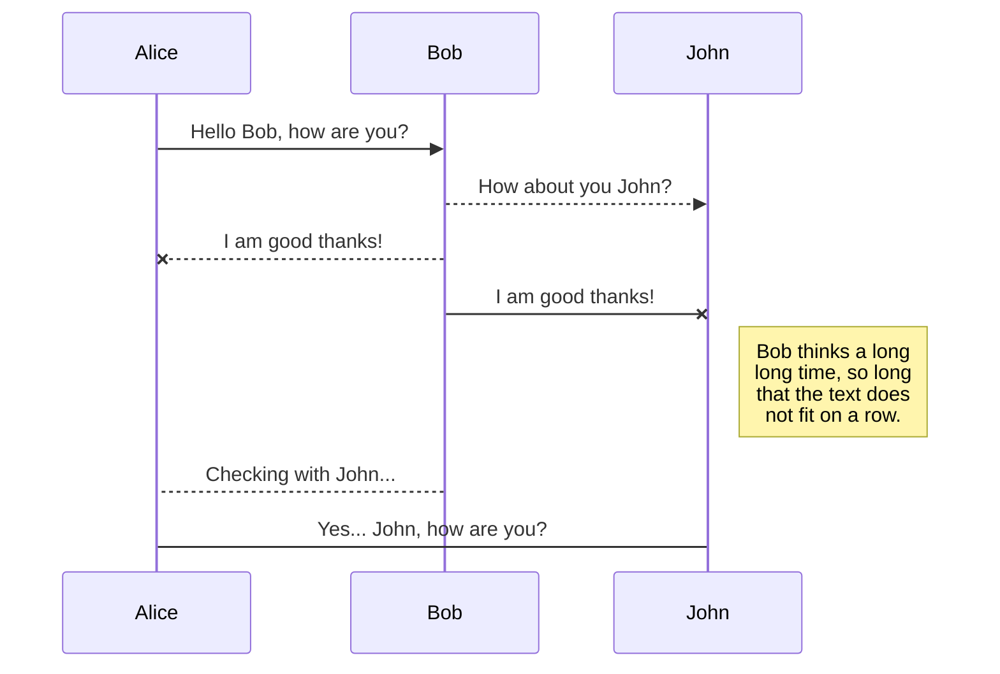

# Kraken: Rapid Deployment Infrastructure for Red Teaming and Penetration Testing (aka: KrakenRDI)

KrakenRDI is a project to easily deploy Docker containers with a full toolbox for RedTeaming and Penetration Testing. Using KrakenRDI you don't need to waste time creating and setting up the environment for you and/or your team. Using KrakenRDI there's more than 100 tools and you can choose which ones should be installed or not in your environment.

# Welcome to Kraken: Rapid Deployment Infrastructure for Red Teaming and Penetration Testing (KrakenRDI)

**KrakenRDI** is a project to helps you with the setup of your environment so you don't need to strunggle with Kali, ParrotOS or similar distributions to get working your environment, stop to waste the valueable resourses of your own system with heavy virtual machines or try to find the reason why your tools in that distributions don't works as expected. Just use containers and work alone or in team.

## Features

- Build and deployment of containers with only the tools that you need or want to use.
- Useful for penetration testing audits or RedTeaming campaings 
- Tools always updated with the latests versions from GitHub or any other kind of repositories/sources. Obviously, it depends on the tool you select.
- WebUI to easily configure your container with the tools of your choice. (TO-DO)
- Images already prepared in DockerHub, so you can use it directly in your own system if you want.
- Modular and granual building of containers. You can  create individual containers for a particular stages in a RedTeaming campaing. For example, you can create a container with the tools and some documentation for the reconnaissance, weaponization, later movements, exfiltration, or any other stage.
- You can create and destroy containers easily, without leaving traces or wasting the resources of your system like virtual machines.
- Simple Rest API to control the images building and containers construction.  

## Architecture

The base architecture is composed by a full set of images for every stage in a Red Teaming campaign following the standard methodology. Every image or layer, have a lot of tools tested and widely used in this kind of tasks.

## Installation

On Debian-based systems: 
`apt update && apt-get -y install python3 python3-dev redis-server
`

Also, you need to install MongoDB Community Edition: https://docs.mongodb.com/manual/installation/  

And Docker-CE depending on your system: https://docs.docker.com/engine/install/  

# Usage

After install dependencies, you can use the images directly or use the Python application:

## Docker images

You can build any of the Docker images created in KrakenRDI, using this repository and the Dockerfiles located in <KRAKENRDI_ROOT_DIR>/core/docker or the DockerHub images.

### Building Docker images

If you want to build an image downloaded from this repository:

Build the image only with tools for anonimity.

cd  <KRAKENRDI_ROOT_DIR>/core/docker 
docker build -t adastra/KrakenRDI:anon -f Dockerfile-anon

Build the image only with tools for recon.
cd  <KRAKENRDI_ROOT_DIR>/core/docker 
docker build -t adastra/KrakenRDI:recon -f Dockerfile-recon

Build the image with specified tools (all of them updated): NMAP, SpiderFoot, MaliciousMacroGenerator, Demiguise.
cd  <KRAKENRDI_ROOT_DIR>/core/docker 
docker build -f Dockerfile-base -t adastraa/krakenrdi:base --build-arg RECON_NMAP=True --build-arg RECON_SPIDERFOOT=True --build-arg WEAPON_MALICIOUSMACROGENERATOR=True --build-arg WEAPON_DEMIGUISE=True .

> **NOTE:**  The file **Dockerfile-base** could be useful to create a image with the specified tools. However, if you don't specify that tools it just create a Debian image as base **without any tool.**
To see the full list of tools and the arg name, follow this link: <LINK>

### Create containers

Just use the image created previously 

## KrakenRDI Rest API and Platform Management

You can use the Python application to manage everything in automatized way. You need 2 components: **KrakenRDI API Server** and **KrakenRDI Backend Server** if you want to use the full features of this software.
**KrakenRDI API Server** starts the Rest API and enables the endpoints which allows to list, create and delete builds and containers. Every "build" just represents the image construction in the Docker service with the specified parameters (including tools available in the image and containers created from that image).
To start the API Server you just need to run the main script with '-r' switch.

`python3 krakenrdi.py -r`

**KrakenRDI Backend Server** starts a background server which receives jobs from the API Server to build a new image in the Docker service. It's only needed to create images using the endpoint **/build/crete** avaible in the **KrakenRDI Api Server**. To start the Backend Server you just need to run the main script with '-w' switch.

`python3 krakenrdi.py -w`

# Toolbox

# Demo videos.

# Contact

If you find any problem let try to discover the root cause and open an issue. For any other matter you can contact contact with me at adastra@thehackerway.com

# Markdown extensions

StackEdit extends the standard Markdown syntax by adding extra **Markdown extensions**, providing you with some nice features.

# SmartyPants

SmartyPants converts ASCII punctuation characters into "smart" typographic punctuation HTML entities. For example:

|                |ASCII                          |HTML                         |
|----------------|-------------------------------|-----------------------------|
|Single backticks|`'Isn't this fun?'`            |'Isn't this fun?'            |
|Quotes          |`"Isn't this fun?"`            |"Isn't this fun?"            |
|Dashes          |`-- is en-dash, --- is em-dash`|-- is en-dash, --- is em-dash|

## KaTeX

You can render LaTeX mathematical expressions using [KaTeX](https://khan.github.io/KaTeX/):

The *Gamma function* satisfying $\Gamma(n) = (n-1)!\quad\forall n\in\mathbb N$ is via the Euler integral

$$
\Gamma(z) = \int_0^\infty t^{z-1}e^{-t}dt\,.
$$

> You can find more information about **LaTeX** mathematical expressions [here](http://meta.math.stackexchange.com/questions/5020/mathjax-basic-tutorial-and-quick-reference).

## UML diagrams

You can render UML diagrams using [Mermaid](https://mermaidjs.github.io/). For example, this will produce a sequence diagram:

