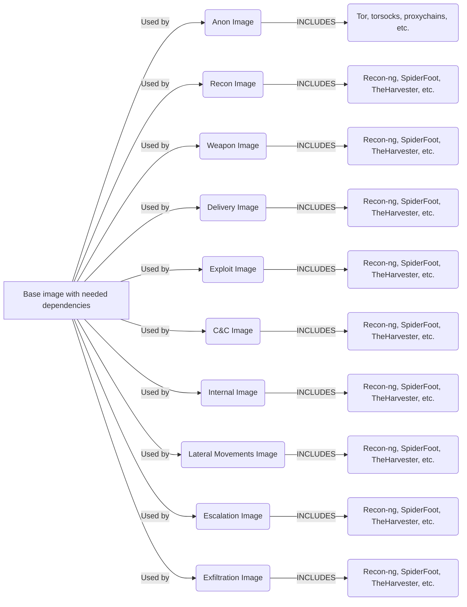
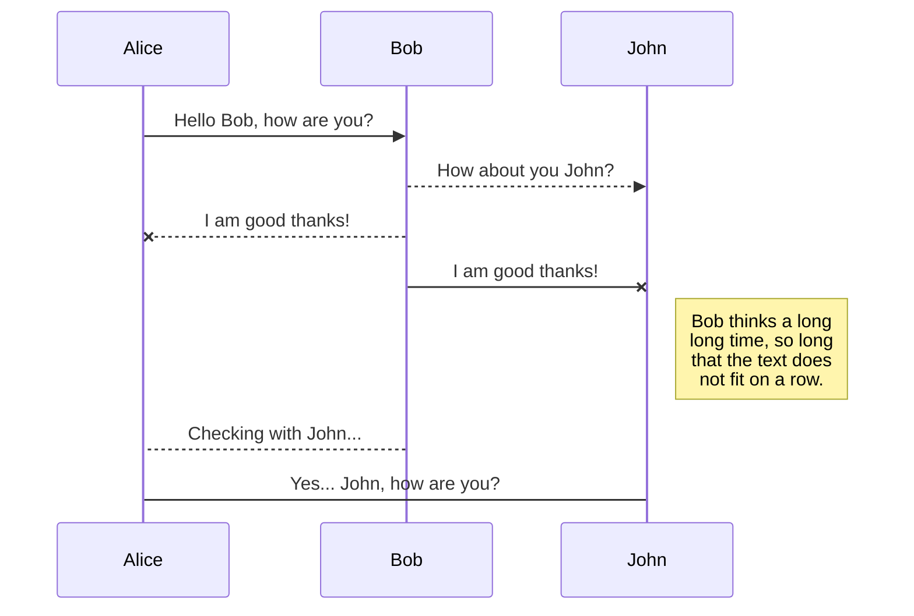
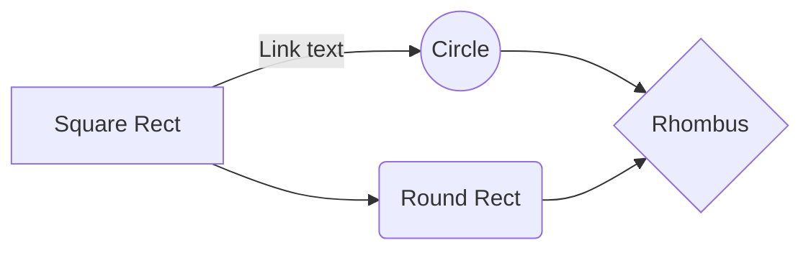

# Kraken: Rapid Deployment Infrastructure for Red Teaming and Penetration Testing (aka: KrakenRDI)
KrakenRDI is a project to easily deploy Docker containers with a full toolbox for RedTeaming and Penetration Testing. With KrakenRDI you don't need to waste time creating and setting up the environment for you and/or your team. Using KrakenRDI there's more than 100 tools and you can choose which ones should be installed or not in your environment.

# Welcome to Kraken: Rapid Deployment Infrastructure for Red Teaming and Penetration Testing (KrakenRDI)

**KrakenRDI** is a project to easily deploy Docker containers with a full toolbox for RedTeaming and Penetration Testing. With KrakenRDI you don't need to waste time creating and setting up the environment for you and/or your team. Using KrakenRDI there's more than 100 tools and you can choose which ones should be installed or not in your environment. Now you don't need to strunggle with Kali, ParrotOS or similar to get working your environment, stop to waste the valueable resourses of your own system with heavy virtual machines. Just use containers and work alone or in team.

## Features
 - Build and deployment of containers with only the tools that you need or want to use.
 - Useful for penetration testing audits or RedTeaming campaings 
 - Tools always updated with the latests versions from GitHub or any other kind of repositories/sources. Depending on the tool.
 - WebUI to easily configure your container with the tools of your choice.
 - Images already prepared in DockerHub, so you can use it directly in your own system if you want.
 - Modular and granual building of containers. You can  create individual containers for a particular stages in a RedTeaming campaing. For example, you can create a container with the tools and some documentation for the reconnaissance, weaponization, later movements, exfiltration, or any other stage. 
 - You can create and destroy containers easily, without leaving traces or wasting the resources of your system like virtual machines.
 -  

## Architecture:
The base architecture is composed by a full set of images for every stage in a Red Teaming campaign. Every image or layer, have a lot of tools tested and widely used in this kind of tasks. 

## Toolbox:

## Installation

## Contact
If you find any problem let try to discover the root cause and open an issue. For any other matter you can contact contact with me at adastra@thehackerway.com

# Markdown extensions

StackEdit extends the standard Markdown syntax by adding extra **Markdown extensions**, providing you with some nice features.

> **ProTip:** You can disable any **Markdown extension** in the **File properties** dialog.

## SmartyPants

SmartyPants converts ASCII punctuation characters into "smart" typographic punctuation HTML entities. For example:

|                |ASCII                          |HTML                         |
|----------------|-------------------------------|-----------------------------|
|Single backticks|`'Isn't this fun?'`            |'Isn't this fun?'            |
|Quotes          |`"Isn't this fun?"`            |"Isn't this fun?"            |
|Dashes          |`-- is en-dash, --- is em-dash`|-- is en-dash, --- is em-dash|

## KaTeX

You can render LaTeX mathematical expressions using [KaTeX](https://khan.github.io/KaTeX/):

The *Gamma function* satisfying $\Gamma(n) = (n-1)!\quad\forall n\in\mathbb N$ is via the Euler integral

$$
\Gamma(z) = \int_0^\infty t^{z-1}e^{-t}dt\,.
$$

> You can find more information about **LaTeX** mathematical expressions [here](http://meta.math.stackexchange.com/questions/5020/mathjax-basic-tutorial-and-quick-reference).

## UML diagrams

You can render UML diagrams using [Mermaid](https://mermaidjs.github.io/). For example, this will produce a sequence diagram:

And this will produce a flow chart:

